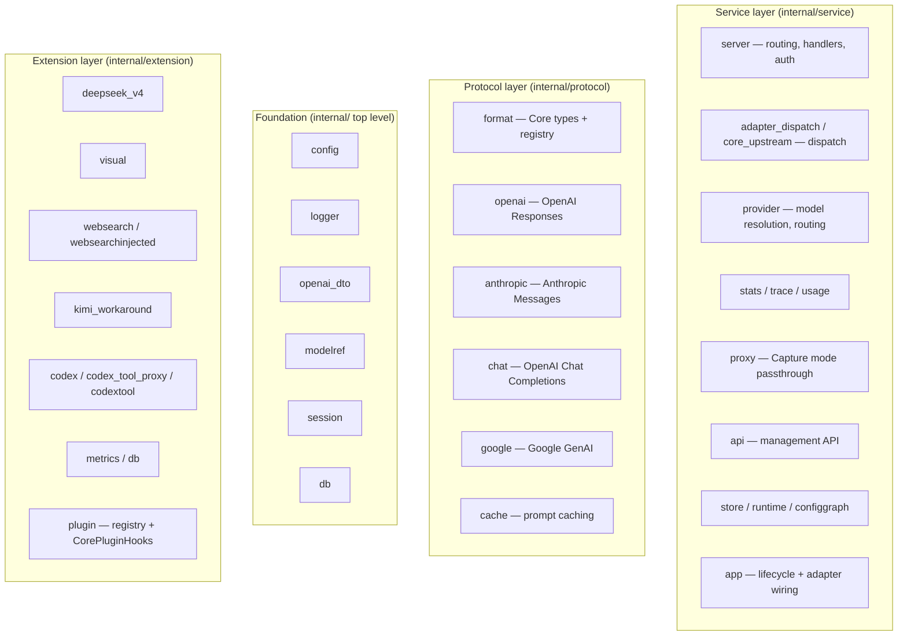
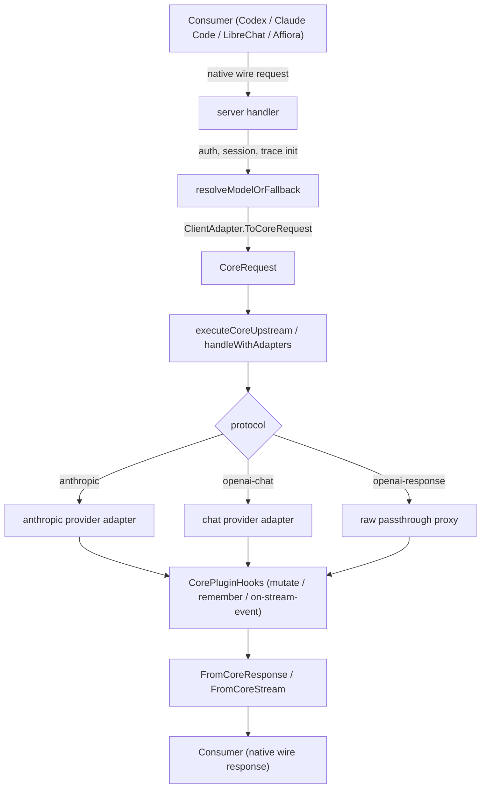

# Architecture

Provider Bridge is a self-hosted, multi-protocol AI model gateway written in
Go. Every consumer speaks its native wire protocol and every upstream provider
speaks its own; the bridge converts all of them through one internal
representation called **Core** (`internal/format`).

This document describes the layers, the three inbound dispatch paths, the Core
IR, the four adapter interfaces and their registry wiring, the cross-cutting
machinery, the config graph, and the extension system.

## Layer structure



### Foundation

Top-level packages under `internal/`, with no dependency on Protocol or
Service:

- `internal/config` — YAML loading, validation, schema generation, hot reload.
- `internal/logger` — `slog.Handler`-based logging with a ring buffer for the
  logs API.
- `internal/openai_dto` — shared OpenAI base types reused across protocols.
- `internal/modelref` — parsing/normalizing `model(provider)` references.
- `internal/session` — session management and per-session state.
- `internal/db` — database provider registry (SQLite / D1).

### Protocol

Protocol conversion. Each adapter implements the interfaces in
`internal/format/adapter.go` and is registered in a `format.Registry`:

- `internal/format` — Core types (`CoreRequest`, `CoreResponse`, `CoreMessage`,
  `CoreContentBlock`, `CoreTool`, `CoreStreamEvent`, ...) and the adapter
  registry.
- `internal/protocol/openai` — OpenAI Responses adapter (inbound adapter and,
  for capture/passthrough, the Responses wire type).
- `internal/protocol/anthropic` — Anthropic Messages adapter (both the inbound
  `AnthropicClientAdapter` and the upstream provider adapter, plus the cache
  manager).
- `internal/protocol/chat` — OpenAI Chat Completions adapter (inbound
  `ChatClientAdapter` and upstream `ChatProviderAdapter`).
- `internal/protocol/google` — Google GenAI upstream adapter.
- `internal/protocol/cache` — prompt-cache planning (breakpoints, TTL).

**Dependency direction (hard rule):** `internal/protocol/*` must **not** import
`internal/service` or `internal/extension`. Protocol packages depend on
`internal/format` and the foundation packages only. Everything the protocol
layer needs beyond that is supplied as a `CorePluginHooks` value built by the
extension layer and passed into adapters at construction time.

### Service

Business orchestration: HTTP server and routing, dispatch, model resolution,
stats, tracing, the management API, the config graph, and the application
lifecycle.

### Extension

Pluggable functionality under `internal/extension/`: `deepseek_v4` (reasoning
replay), `visual` (image-orchestration), `websearch` and `websearchinjected`
(server-side search), `kimi_workaround`, `codex`, `codex_tool_proxy`,
`codextool`, `metrics`, `db`, and the `plugin` registry. See the extension
system overview below.

## The Core intermediate representation

`internal/format` defines the wire-independent types:

- **`CoreContentBlock`** — one flattened struct discriminated by `Type`:
  `"text"`, `"image"` (`ImageData` + `MediaType`), `"tool_use"`
  (`ToolUseID`/`ToolName`/`ToolInput`), `"tool_result"` (`ToolUseID` +
  `ToolResultContent`), `"reasoning"` (`ReasoningText` + `ReasoningSignature`).
- **`CoreMessage`** — `Role` + `Content` blocks. The system prompt lives on the
  request (`CoreRequest.System`), not in messages.
- **`CoreRequest` / `CoreResponse`** — the full request/response. `CoreRequest`
  carries `Tools`, `ToolChoice` (`Mode` + `Name` + `Raw` for lossless
  round-trip), `Thinking`, `Output` (effort), sampling parameters, and
  `Extensions` (per-protocol passthrough, e.g.
  `Extensions["openai"]["reasoning"]["effort"]` for the openai-chat upstream).
- **`CoreStreamEvent`** — the stream event union. `CoreStreamEventType` covers
  the lifecycle (created / in-progress / completed / incomplete / failed),
  content-block lifecycle (started / delta / done), text deltas, tool-argument
  deltas, item add/done, and ping. Reasoning deltas are `CoreTextDelta` events
  whose `ContentBlock.Type == "reasoning"`.

### Wire-level invariants (do not regress)

1. **Tool results are Core role `"tool"`** — not `user` + `tool_result`.
   Anthropic carries tool results in user messages; Chat carries them as
   `role:"tool"` with `tool_call_id`; both upstream adapters expect the
   canonical Core `tool` role.
2. **Chat tool `arguments` are JSON strings** on the wire
   (`"arguments":"{\"a\":1}"`), produced by `jsonQuote`.
3. **An empty `json.RawMessage` is invalid JSON** — serialize empty tool
   arguments as `""`; a marshal failure must not silently drop an SSE chunk.
4. **The visual-path synthesizer emits `CoreToolCallArgsDone`** (complete
   arguments in one event), not only incremental `CoreToolCallArgsDelta`;
   stream loops must handle both. Two synthesizers exist
   (`coreResponseToStreamEvents` and `coreResponseToCoreStream`) — a tool
   streaming fix must cover both.

## Adapter interfaces

All conversion flows through Core via four interfaces defined in
`internal/format/adapter.go`:

```go
// Inbound request/response conversion.
type ClientAdapter interface {
    ClientProtocol() string
    ToCoreRequest(ctx context.Context, req any) (*CoreRequest, error)
    FromCoreResponse(ctx context.Context, resp *CoreResponse) (any, error)
}

// Inbound streaming serialization: Core events -> protocol stream.
type ClientStreamAdapter interface {
    ClientProtocol() string
    FromCoreStream(ctx context.Context, req *CoreRequest, events <-chan CoreStreamEvent) (any, error)
}

// Upstream request/response conversion.
type ProviderAdapter interface {
    ProviderProtocol() string
    FromCoreRequest(ctx context.Context, req *CoreRequest) (any, error)
    ToCoreResponse(ctx context.Context, resp any) (*CoreResponse, error)
}

// Upstream streaming: provider stream source -> Core events.
type ProviderStreamAdapter interface {
    ProviderProtocol() string
    ToCoreStream(ctx context.Context, src any) (*StreamResult, error)
}
```

Two optional extensions exist for adapters that need request metadata (e.g. the
tool-expansion map used for namespace tools): `ProviderRequestAwareAdapter`
(`ToCoreResponseWithRequest`) and `ProviderRequestAwareStreamAdapter`
(`ToCoreStreamWithRequest`).

`ProviderStreamAdapter.ToCoreStream` returns a `*StreamResult` — a channel of
`CoreStreamEvent` plus a `StreamBuffer func() []any` that exposes the captured
raw upstream events for trace, reasoning replay, and post-stream processing.
The adapter owns the read-loop.

### Registry wiring

Adapters are registered in `internal/service/app/app.go` (~line 245) into a
`format.NewRegistry()`:

| Direction | Protocol ID | Adapter |
|-----------|-------------|---------|
| Inbound | `openai-response` | `openai.NewOpenAIAdapter` |
| Inbound | `anthropic-messages` | `anthropic.NewAnthropicClientAdapter` |
| Inbound | `chat-completions` | `chat.NewChatClientAdapter` |
| Upstream | `anthropic` | `anthropic.NewAnthropicProviderAdapter` |
| Upstream | `google-genai` | `google.NewGeminiProviderAdapter` |
| Upstream | `openai-chat` | `chat.NewChatProviderAdapter` |

Each inbound adapter registers both its `ClientAdapter` and
`ClientStreamAdapter`; each upstream adapter registers both its
`ProviderAdapter` and `ProviderStreamAdapter`. Upstream adapters return **Core**
— the per-protocol switch in the server only type-asserts the produced wire
request and picks the right HTTP client for the provider.

## Request paths

There are three inbound paths and two dispatch implementations.

### 1. OpenAI Responses inbound (`/v1/responses`, `/responses`)

`dispatch.go` `handleResponses` parses the request and routes it:

- An **OpenAI-response upstream** (protocol `openai-response`) uses a raw
  passthrough proxy (`handleOpenAIResponse`).
- Every other upstream protocol goes through the adapter path:
  `adapter_dispatch.go` `handleWithAdapters` (non-streaming) or
  `handleAdapterStream` (streaming). This is the original Responses-inbound
  dispatch (Core in, OpenAI wire out) and is deliberately **untouched** —
  keeping the proven Codex path unchanged is a project policy.

### 2. Anthropic Messages inbound (`/v1/messages`)

`inbound_handlers.go` `handleAnthropicMessages`: parse the Anthropic wire
request → `AnthropicClientAdapter.ToCoreRequest` → `executeCoreUpstream` →
either `FromCoreResponse` (non-streaming) or `FromCoreStream` +
`writeAnthropicSSE` (streaming).

### 3. Chat Completions inbound (`/v1/chat/completions`)

`inbound_handlers.go` `handleChatCompletions`: parse the Chat request
(including `max_tokens` normalization) → `ChatClientAdapter.ToCoreRequest` →
`executeCoreUpstream` → either `FromCoreResponse` or `FromCoreStream` +
`writeChatSSE`.

### The shared Core executor

Paths 2 and 3 share `core_upstream.go` `executeCoreUpstream`, which does the
whole upstream half from a `CoreRequest`:

- resolve the preferred provider candidate and its protocol;
- override the Core model alias with the upstream model name;
- resolve and apply **web-search injection**;
- convert to the upstream wire request via the provider adapter;
- run **visual orchestration** when the request carries images the candidate
  cannot consume natively;
- execute upstream (streaming or not) and return a `coreUpstreamOutcome`.

Supported upstream protocols in this executor: `anthropic` and `openai-chat`.
Google-genai and any other protocol returns a clear error that the calling
handler renders in its own wire format (no configured provider uses genai
today; add a case when one does).

> **Why two dispatch paths exist:** the Responses path predates the inbound
> era and carries the Codex-critical raw-passthrough behavior. Unifying the two
> (`handleWithAdapters` into `executeCoreUpstream`) is deliberate future work,
> not a completed migration. Until then the Responses path stays byte-for-byte
> unchanged.

### Request lifecycle (adapter path)



## Cross-cutting machinery

These features are implemented once and reused across inbounds.

### Model resolution

`internal/service/provider/manager.go` `ResolveModel`: route alias →
`provider/model` or `model(provider)` reference → dynamic catalog. The
`provider/model` slug ids exposed by `/v1/models` resolve natively. Candidate
selection also filters image-incapable providers when the request carries an
image (`filterCandidatesByInput`).

### Capability-driven visual orchestration

`internal/extension/visual` routes image inputs to a vision-capable model when
the selected upstream cannot consume them. `wrapWithVisual` returns `nil`
unless the resolved model has visual config.

The gate is per request (aligned to the proven Anthropic pattern, issue #4
remediation):

```go
needsAssist := coreRequestHasImage(coreReq) && !s.candidateSupportsImage(candidate)
```

The visual orchestrator is attempted first when `needsAssist` is true. Only on
the fall-through (the orchestrator returned `nil` / did not run) are images
stripped for a text-only upstream, with an explicit warning log. `wrapWithVisual`,
`ConfigForModelFromResolvedConfig`, `StripImagesFromAnthropic`,
`StripImagesFromChat`, and `core_orchestrator.go` are shared and untouched by
the gate.

The visual path synthesizes streaming events and, notably, emits complete tool
arguments in a single `CoreToolCallArgsDone` event; the Chat and Anthropic
client stream loops handle both that and incremental `CoreToolCallArgsDelta`.

### Server-side web-search injection

`injectCoreWebSearch` replaces `web_search` tools in `CoreRequest.Tools` with
the injected function tools `tavily_search` and `firecrawl_fetch`
(`internal/extension/websearchinjected`). Execution happens inside the bridge,
so the consumer never sees the injected `tool_use` blocks. The execution loops
live in `internal/service/server/websearch_inject.go`:
`executeChatSearchLoop` / `chatSearchBufferedStream` (wire-level, openai-chat),
`executeCoreSearchLoop` (Core-level, used by the visual path), and the Google
loop.

**Resolution is startup-only** — any web_search config change requires a
container restart. See [WEB-SEARCH.md](WEB-SEARCH.md).

### DeepSeek reasoning replay

Reasoning returned by DeepSeek-compatible upstreams is cached per session
(`cacheReasoningForChat`) and prepended to follow-up requests
(`prependCachedReasoningForChat` / `prependCachedThinking`). The empty-
`reasoning_content` replay is gated on providers that require it — Mistral
rejects the field entirely.

### Session keying

`session.go` `sessionKeyFromRequest` resolves a session key from the
`Session_id`, `X-Codex-Window-Id`, or `X-Claude-Code-Session-Id` headers;
otherwise the request gets an ephemeral session. Keying on the Claude Code
header enables cross-request reasoning replay for that consumer. See
[API.md](API.md#session-headers).

### Pricing, usage, and tracing pipeline

- **Pricing** — per-model prices come from provider offers
  (`provider.BuildPricingFromConfig`) and feed `computeCostWithProviderPricing`
  during `recordInboundCompletion`.
- **Usage** — every completed inbound request records tokens and cost into the
  session stats (`stats.SessionStats`), surfaced by `/api/v1/stats*` and
  aggregatable across sessions via the persisted usage source.
- **Tracing** — `internal/service/trace` writes request/response records to
  `session/<model>/<category>/<n>.json` when tracing is enabled, capturing both
  the inbound wire request and the upstream stream events.

### Config graph

SQLite (`data/provider-bridge.db`, `config_store_*` tables) is the live source
of truth, managed through `/api/v1/config/graph`
(`internal/service/configgraph`). `config.yml` is the seed and mirror (and the
input for Codex catalog generation). Graph reads mask secrets with `******`
(`configgraph.secretMask`): `server.auth_token`, provider `api_key`, web-search
`tavily_api_key`/`firecrawl_api_key`, and nested proxy `api_key` fields. Read
real keys from `config.yml`. Runtime changes go through the pending-changes
flow (`/api/v1/changes` → `/changes/apply`), which rebuilds the runtime
snapshot.

## Extension system

`internal/extension/plugin` defines the plugin interfaces and the registry that
the server talks to. Plugins expose **capabilities** (for example a config-spec
provider, a usage source, or request/stream hooks), and the registry converts
the built-in extensions into two hook sets:

- **`CorePluginHooks`** — protocol-agnostic hooks operating on Core types
  (`PreprocessInput`, `RewriteMessages`, `InjectTools`, `MutateCoreRequest`,
  `PostProcessCoreResponse`, `OnStreamEvent`, `OnStreamComplete`,
  `FilterContent`, `RememberContent`, `NewStreamState`,
  `PrependThinkingToAssistant`, ...). These are constructed from the registry
  and injected into every adapter at registration time, preserving the
  no-reverse-dependency rule for `internal/protocol/*`.
- The legacy `PluginHooks` used by the Responses bridge path.

Shipped extensions include `deepseek_v4`, `visual`, `websearchinjected`,
`kimi_workaround`, `codex`, `codex_tool_proxy`, `codextool`, `metrics`, and the
`db` persistence providers. See [EXTENSION-SYSTEM.md](EXTENSION-SYSTEM.md) and
[EXTENSIONS.md](EXTENSIONS.md) for the interfaces and catalog.

## Running modes

| Mode | Inbound → upstream | Description |
|------|--------------------|-------------|
| `Transform` (default) | any inbound → any adapter | Full protocol-conversion pipeline |
| `CaptureAnthropic` | Anthropic Messages → Anthropic | Transparent passthrough |
| `CaptureResponse` | OpenAI Responses → OpenAI | Transparent passthrough |

## Provider protocols

Each provider declares its upstream protocol via the `protocol` field:

| Value | Upstream format | Adapter |
|-------|-----------------|---------|
| `anthropic` (default) | Anthropic Messages API | `internal/protocol/anthropic` |
| `openai-response` | OpenAI Responses API | `internal/protocol/openai` (raw passthrough) |
| `google-genai` | Google Generative AI (Gemini) API | `internal/protocol/google` |
| `openai-chat` | OpenAI Chat Completions API | `internal/protocol/chat` |
