# Development Conventions

## Package layout

```mermaid
flowchart TD
  subgraph internal["internal/"]
    direction TB
    config["config/ — config load/validate/schema"]
    logger["logger/ — structured logging (slog wrapper)"]
    openai_dto["openai_dto/ — shared OpenAI DTOs"]
    modelref["modelref/ — model reference parsing"]
    session["session/ — session management"]
    db["db/ — database abstraction + registry"]
    fmt["format/ — Core types / Registry / Adapter interfaces"]

    subgraph protocol["protocol/ — protocol conversion layer"]
      direction TB
      pa["anthropic/ — Anthropic Messages adapter"]
      pc["cache/ — prompt cache planning"]
      pch["chat/ — OpenAI Chat adapter"]
      pg["google/ — Google Gemini adapter"]
      po["openai/ — OpenAI Responses adapter"]
    end

    subgraph service["service/ — business orchestration"]
      direction TB
      sa["api/ — management REST API"]
      sapp["app/ — lifecycle + extension catalog"]
      scg["configgraph/ — config graph + patch/validation"]
      se["e2e/ — service-level E2E tests"]
      sp["provider/ — provider manager"]
      spr["proxy/ — Capture-mode proxy"]
      srt["runtime/ — runtime context"]
      subgraph srv["server/ — HTTP server / routes / auth / dispatch"]
        direction TB
        ss["session/ — session handling"]
        st["trace/ — request tracing"]
        su["usage/ — usage tracking"]
      end
      sst["stats/ — usage statistics"]
      sw["webui/ — embedded Web Console"]
    end

    subgraph extension["extension/ — pluggable extensions"]
      direction TB
      ec["codex/ — Codex model catalog"]
      subgraph edb["db/ — database providers"]
        es["sqlite/"]
        ed1["d1/"]
      end
      eds["deepseek_v4/ — DeepSeek V4 reasoning"]
      ek["kimi_workaround/ — Kimi tool-call round limiter"]
      em["metrics/ — usage metrics"]
      ep["plugin/ — Plugin + capability interfaces + registry"]
      ev["visual/ — visual orchestration (CoreProvider)"]
      ew["websearch/ — web-search orchestrator"]
      ewi["websearchinjected/ — injected search module"]
      ectp["codex_tool_proxy/ — apply_patch proxy"]
      ect["codextool/ — Codex tool types + mapping"]
    end

    e2e["e2e/ — protocol conversion E2E tests"]
  end
```



`internal/protocol/format` is a legacy leftover (present on disk, not imported
by any package). All Core types and adapter interfaces live in
`internal/format`.

## Dependency direction

```
extension → config, format, protocol
service   → config, format, protocol, extension
protocol  → config, format
format    → config, openai_dto
config, logger, modelref, session, db → (no internal dependencies)
```

Reverse dependencies are forbidden. In particular:

- `internal/protocol/*` must not import `internal/service` or
  `internal/extension` (in that direction, the protocol layer stays a leaf).
- `extension` must not import `service`.
- Foundation packages (`config`, `logger`, `modelref`, `session`, `db`) must not
  import `protocol`, `service` or `extension`.

## Cycle prevention

Plugins and the protocol layer are decoupled by the `CorePluginHooks` function
struct in `internal/format/adapter.go`:

1. `extension/plugin/Registry.CorePluginHooks()` chains the capabilities of all
   registered plugins into a `format.CorePluginHooks`.
2. Adapters and the server accept `CorePluginHooks` as a dependency and call the
   hooks during request handling.
3. Plugins implement the capability interfaces defined in
   `extension/plugin/capabilities.go` (`CoreRequestMutator`,
   `CoreContentFilter`, and the rest) without importing `protocol` or `service`.

## Coding standards

### Go version

Use `go 1.25`, taking advantage of current language features.

### Naming

- **Package names:** all lowercase, singular (`plugin`, `config`).
- **Interface names:** behavior-driven (`InputPreprocessor`, `ContentFilter`,
  `DBProvider`).
- **Error variables:** `Err` prefix (`ErrNotFound`).
- **Constants:** CamelCase (`ProtocolAnthropic`, `ModeTransform`).

### Package documentation

Every package has a package-level doc comment describing its responsibility and
usage (see `internal/extension/plugin/plugin.go` and
`internal/extension/websearchinjected/websearchinjected.go`).

### Error handling

- Wrap error chains with `fmt.Errorf("context: %w", err)`.
- Define named error types where useful (`RequestError`, `ProviderError`,
  `CachePlanError`).
- **Error and log messages are English.** There is no localized-message policy;
  the project is English-only.

### Logging

- Use the `internal/logger` package, built on `slog`.
- Call `slog.Info()`, `slog.Warn()`, `slog.Error()`, `slog.Debug()` or
  `slog.Default().With(...)`.
- Add structured fields with `With("key", value)`; group related attributes
  with `WithGroup` / `slog.Group`.
- Supported levels: `debug`, `info`, `warn`, `error` (`off` disables output).

### Config evolution

The project is pre-release, so backward compatibility is not preserved at
runtime. When the config structure changes:

1. Update `config.example.yml`.
2. Update `FileConfig` and `LoadFromFileWithOptions()` in
   `internal/config/config_loader.go`.
3. Update related scripts (`scripts/`).
4. Update the README, `docs/CONFIG-MIGRATION.md` and this document.

Extension-owned config must not be added to the core config struct. An
extension implements `plugin.ConfigSpecProvider` and declares the scope,
defaults, typed config factory and validation for
`extensions.<name>.enabled/config`. The core config keeps only the generic
`extensions` slot and the `ExtensionEnabled` / `ExtensionConfig` resolvers.

### Makefile

| Command | Description |
|---------|-------------|
| `make build` | Build all packages |
| `make test` | Run all tests |
| `make cover` | Print coverage |
| `make cover-check` | Enforce package coverage ≥95% (currently `internal/extension/plugin`) |
| `make webui-build` | Build the Console and copy it into the embed dir |
| `make build-with-webui` | Go build with the embedded Console |

## Testing rules

### Coverage targets

- `internal/extension/plugin` has an enforced coverage floor of ≥95%.
- The core protocol layer should stay well covered.
- New features ship with tests.

### Test tiers

- Unit tests: exercise a single package with external dependencies mocked.
- Protocol E2E (`internal/e2e/`, `//go:build e2e`): full request/response
  conversions using mock upstreams.
- Service E2E (`internal/service/e2e/`, `//go:build e2e`): full HTTP
  request/response paths.
- Management API tests (`internal/service/api/`): endpoint behavior and
  integration.

### Test data

- Keep fixtures inline or under `testdata/`.
- Avoid external network dependencies; mock the HTTP client.

## Extension development conventions

- Put each plugin in `internal/extension/<name>/`.
- A plugin implements `plugin.Plugin` (Name + Init + Shutdown +
  EnabledForModel).
- Implement zero or more capability interfaces from
  `internal/extension/plugin/capabilities.go` (`CoreRequestMutator`,
  `CoreContentFilter`, …).
- Add compile-time interface assertions at the end of `plugin.go`.
- A plugin that needs config implements `plugin.ConfigSpecProvider`; config
  comes from `extensions.<name>.config`, and enablement resolves through
  `extensions.<name>.enabled` with global/provider/model/route inheritance.
- `PluginContext.Config` carries the typed config; `PluginContext.AppConfig`
  exposes the read-only global config and per-model resolver.
- Built-in extensions are collected by the catalog in
  `internal/service/app/extensions.go`, which aggregates specs and builds the
  `plugin.Registry`.
